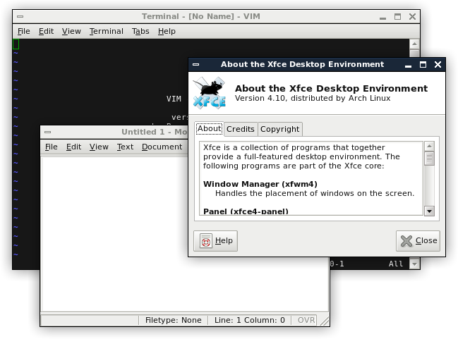

Klxf - an xfwm4 theme
=====================
Klxf is a simple xfwm4 theme, based heavily on the built-in *Next* theme. It is designed be concise, yet functional.

Installation
------------
Place the xfwm4 directory in *~/.themes/klxf* then select "klxf" in your xfce window manager settings.
